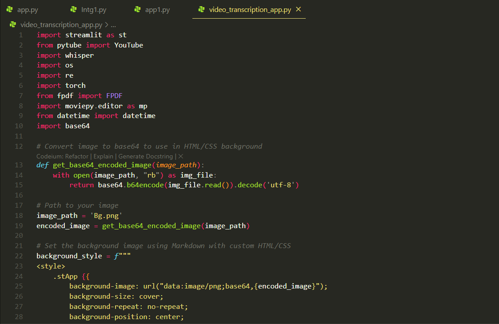
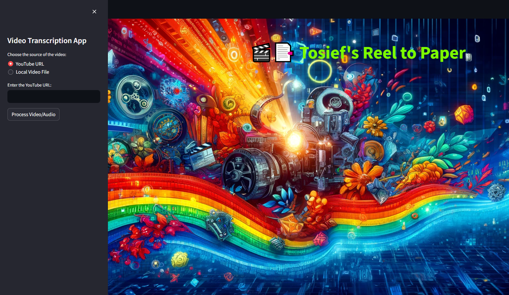
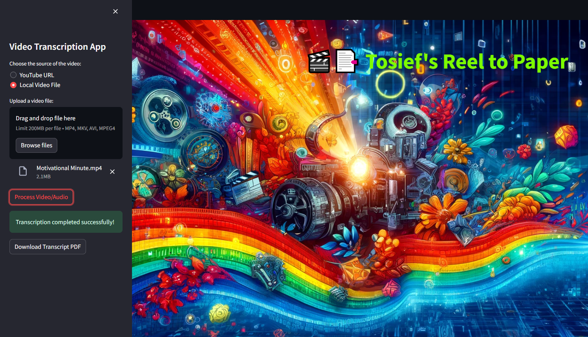
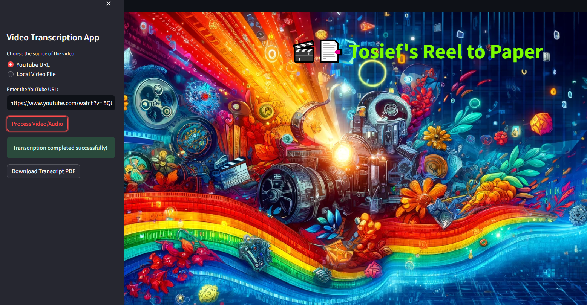

"# VideoTranscriber" 

## **Snapshot of the application's backend code in an IDE, showing the Python script for base64 image encoding**
### **This image displays a section of the backend code for a video transcription app, viewed in an Integrated Development Environment (IDE). The Python script includes imports and functions for converting images to base64 format, which is used to embed images directly into HTML/CSS files for the application's user interface.**

## **Initial interface of the Video Transcription App on Streamlit, showcasing the option to input a YouTube URL**
### **This image features the initial user interface of the Video Transcription App built in Streamlit. The interface allows users to select the video source (YouTube URL or local video file) and includes a vibrant, colorful background. The primary function shown is the input field for a YouTube URL, enabling easy access for processing video content.**

## **Updated interface displaying the file upload feature for local video files in the Video Transcription App**
### **Here, the interface of the Video Transcription App is shown with an updated feature that allows users to upload local video files. The interface supports drag-and-drop functionality and displays an example of a successfully uploaded video file named "Motivational Minute.mp4," ready for processing.**

## **Final interface showing the transcription process completed successfully with options for downloading the transcript**
### **The final image depicts the Video Transcription App interface after successfully processing a video. It shows an option to download the resulting transcript as a PDF file, providing a complete and user-friendly experience from video input to transcription output.**

